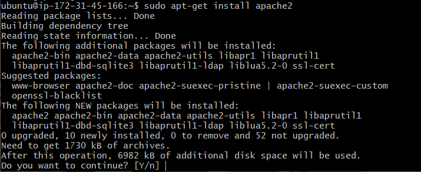
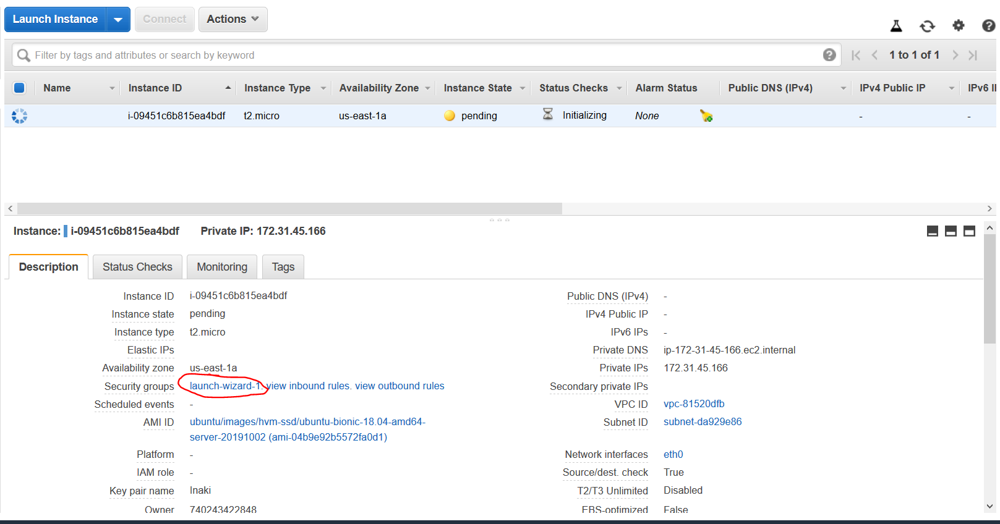
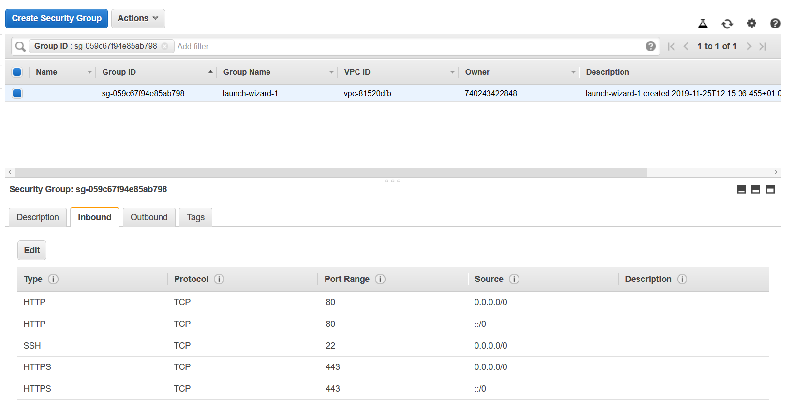

# Instalacion de servicios basicos de ubuntu server
## Instalacion de apache2
Primero antes que nada es siempre recomendable hacer un update de los repositorio


A continuacion despues de actualizar los repositorios vamos a instalar el apache2


Ya hemos terminado la instalacion del apache, es bastante sencillo pero deberemos hacer cambios en el aws para que funcione el protocolo http/https

Para esto deberemos meternos en el panel de control y en la descripcion deberemos elegir el launch wizard


A continuacion deberemos darle a editar y a continuacion añadiremos los servicios http y https


## Instalar mySQL
primero pondremos este comando para que instalemos el mysql server con este comando


y a continuacion pondremos el comando para configurar el servicio 


## Instalar phpmyadmin
Pondremos el siguiente comando para instalar


ahora comenzaremos con los pasos de la instalacion

* primero aquí elegiremos apache **pulsando espacio** y cuando lo hayamos hecho le daremos a enter


* seleccionaremos la opcion de configurar la base de datos


* ahora nos toca elegir la contraseña, aquí se aplican las reglas de cuando has configurado el mysql

* a continuacion elegiremos el metodo de conexion a la base de datos, en mi caso he elegido TCP/IP que es el mas usado

* en el siguiente paso elegiremos el host, en mi caso he elegido localhost

* para este paso en un principio no deberemos cambiar el puerto

* ahora elegiremos el nombre de la base de datos

* Y por último el usuario del phpmyadmin


al terminar todo esto podemos hacer una comprobacion de si hemos conseguido instalar con exito


## Conexion SQL php

Por ultimo para crear la conexion entre SQL y ya lo tendriamos todo preparado para ponernos a trabajar
```
sudo apt install php libapache2-mod-php php-mysql
```


