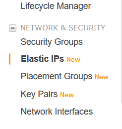

# Asociar una IP elastica a una maquina amazon

en el panel de control de EC2 tenemos que elegir esta opcion en los menus

 

a contuniacion deberemos pulsar el boton naranja diciendo *allocate elastic IP address*

 

dejaremos el siguiente campo como esta por predeterminado

ya hemos creado la ip elastica, ahora nos queda asociarlo a una maquina en concreto
 

por ultimo rellenariamos los campos con los datos de nuestras maquinas virtuales y con esto ya habriamos creado una IP elastica
 

