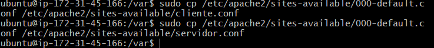
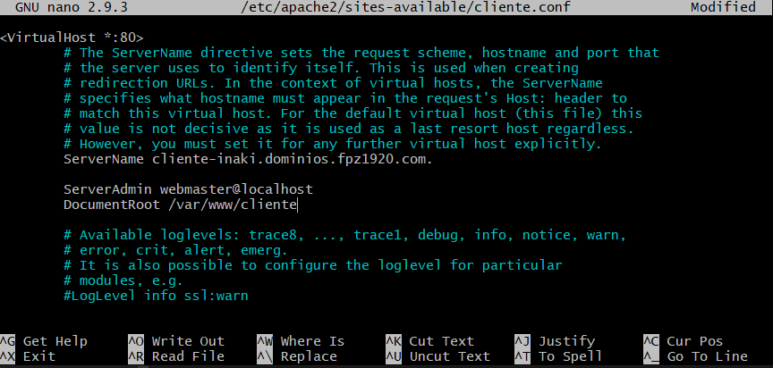

# Creacion de virtualhosts

Primero crearemos los registros DNS (como en la tarea anterior)

en este caso crearemos uno de cliente y otro de server


a continuacion crearemos 2 carpetas, una de cliente y otra de servidor (con sus respectivos index)


despues debemos darle los permisos necesarios a la carpeta


en el siguiente paso crearemos copias 


ahora deberemos editar cada archivo con el servername adecuado (el del registro DNS) y cambiar el documentroot a la carpeta *que en este ejemplo es la de cliente*


despues de realizar estos pasos deberemos habilitar dicha configuración con el siguiente comando

```sh
sudo a2ensite cliente.conf
```
y por ultimo nos saldría que usemos este comando para reiniciar el servicio y ya podríamos trabajar con el virtualhost
```sh
sudo systemctl restart apache2
```

