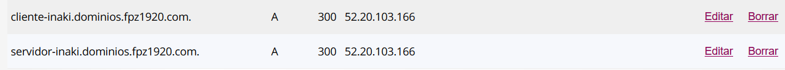
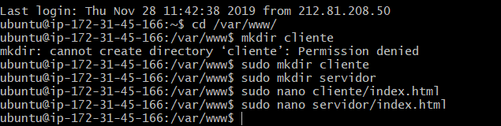

# Creacion de virtualhosts

Primero crearemos los registros DNS (como en la tarea anterior)

en este caso crearemos uno de cliente y otro de server

a continuacion crearemos 2 carpetas, una de cliente y otra de servidor (con sus respectivos index)

