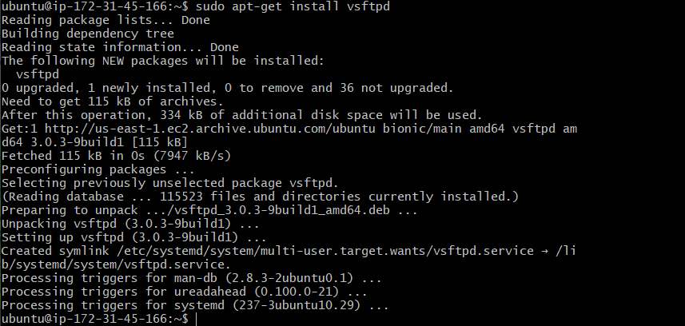

# Configurar servidor FTP
primero deberemos poner este comando para instalar el servicio vsftpd

si no funciona prueba a poner los siguientes comandos
```bash
sudo apt-get update

sudo apt-get upgrade
```


a continuacion usaremos estos comandos para que el servicio funcione


en el siguiente paso crearemos usuarios para el servicio FTP


deberemos tener las siguientes lineas sin comentar:


para que nos funcione deberemos habilitar en nuestro servidor el puerto de entrada de ftp (el 21)


por ultimo reiniciaremos el servicio y ya podríamos usarlo
