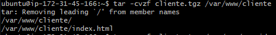
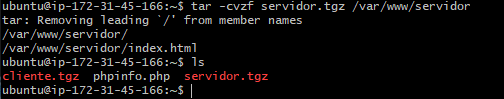
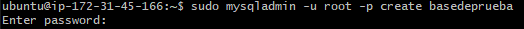
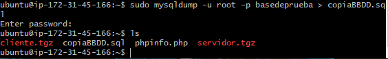

# crear un fichero TAR y exportar la base de datos

Primero pondremos el siguiente comando para crear el tar

<i>**Nota:** despues de eso podemos usar ls para ver si los archivos se han creado correctamente en el directorio en el que estabamos posicionados</i>

en el siguiente paso utilizaremos este comando para crear una base de datos

Y por último haremos uso de este comando para exportar la base de datos 
