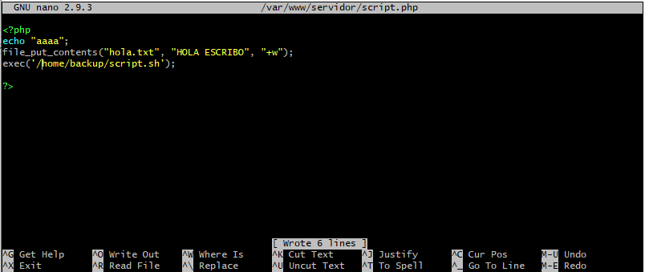
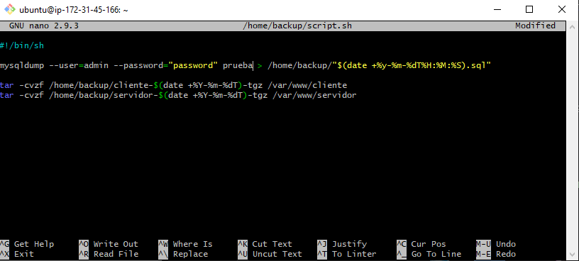
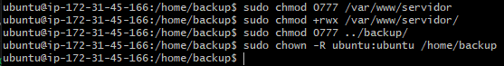
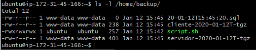
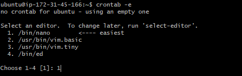
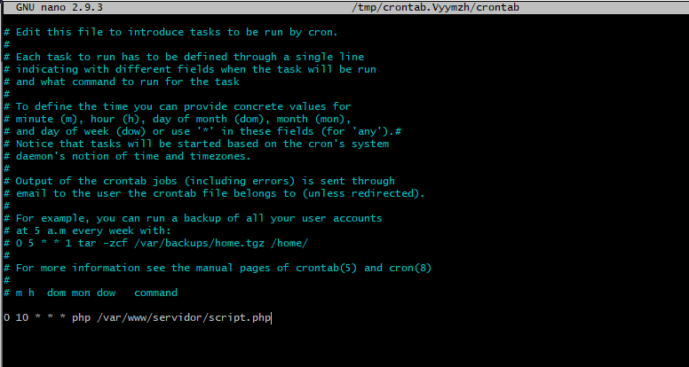

## Creación de backups de forma manual y automatizada
Empezaremos creando una carpeta para almacenar los backups


A continuacion crearemos un archivo php usando nano que contenga las siguientes lineas (Yo lo he creado en la carpeta servidor de www para acceder mediante el navegador)


Luego crearemo el script que estará en la misma carpeta que los backups


Tendremos que ejecutar estas lineas de comando para que cada archivo tenga sus respectivos permisos
```NOTA: en la captura no sale pero hay que darle permisos al script.sh mediante sudo chmod 777 [file]```



Ahora podemos crear un backup desde el navegador! en mi caso poniendo el siguiente link

http://servidor-inaki.dominios.fpz1920.com/script.php

```NOTA: en mi caso no se crea el archivo mysql porque no he podido acceder a la base de datos ```


#### Automatizacion

Primero abriremos el crontab con el siguiente comando y elegiremos el editor de archivos que queramos


Ahora añadiremos cada cuanto queremos que se ejecute, en mi caso se ejecutara el dia 10 de cada mes


Por último añadiremos una linea para que borre los backups 3 dias despues de su creación

